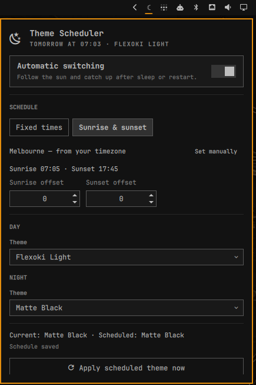

# Theme Scheduler for Omarchy

Automatically switch between a light and dark Omarchy theme at sunrise and
sunset, or at times you set. The plugin runs inside Omarchy Shell, catches up
after sleep or restart, and does not require root access or systemd units.

This is a fork of [acrogenesis/omarchy-theme-scheduler][upstream] that adds
solar scheduling.

[upstream]: https://github.com/acrogenesis/omarchy-theme-scheduler



## Features

- Independent day and night themes
- Sunrise/sunset scheduling, computed locally, from a location it works out for itself
- Random light and dark choices using each theme's Omarchy mode metadata
- 15-minute schedule controls
- Local-time operation with overnight schedules supported
- Resume/restart catch-up
- Manual theme overrides remain until the next scheduled boundary
- Bar panel, middle-click “apply now,” and shell IPC controls
- Configuration stored at `~/.config/omarchy/theme-scheduler-solar/config.json`

## Install

```bash
omarchy plugin add https://github.com/dkam/omarchy-theme-scheduler.git --enable
```

The plugin is safe on first install: its internal automation toggle defaults
to off. Add its widget to the bar, choose the two themes and times, then enable
automatic switching.

## Requirements

- Omarchy 4 with the Quattro shell plugin API
- No external packages, root access, or background system services

## Remove

```bash
omarchy plugin remove dkam.theme-scheduler-solar
```

Removing the plugin leaves its settings at
`~/.config/omarchy/theme-scheduler-solar/config.json` so a later reinstall can reuse
them. Delete that file separately only if you also want to discard the saved
schedule and theme choices.

For local development:

```bash
ln -sfn "$PWD" ~/.config/omarchy/plugins/dkam.theme-scheduler-solar
omarchy plugin enable dkam.theme-scheduler-solar --section right
```

## Commands

```bash
omarchy-shell dkam.theme-scheduler-solar status
omarchy-shell dkam.theme-scheduler-solar enable
omarchy-shell dkam.theme-scheduler-solar disable
omarchy-shell dkam.theme-scheduler-solar applyNow
```

## How scheduling behaves

At each day/night boundary, the service applies the configured theme with
`omarchy theme set`. It records that boundary after a successful switch. This
means choosing another theme manually will not be immediately undone; the
scheduler takes control again at the next boundary.

The day and night pickers also offer **Random light theme** and **Random dark
theme**. Omarchy declares the classification as `mode = "light"` or `mode =
"dark"` in each theme's effective `colors.toml`. Themes without that metadata
remain available for explicit selection but are excluded from random choices.
Each picker lists its matching mode first, the opposite mode second, and any
unclassified themes last; themes within every group are alphabetical.

The service evaluates the wall clock every minute. If the computer sleeps
through a boundary or Omarchy Shell starts later, it applies the theme for the
current period when it resumes.

## Solar scheduling

Choose **Sunrise & sunset** in the panel. There is usually nothing else to set:
the panel names the location it is using, and offers coordinate fields only if
you want to override it.

Sunrise and sunset are computed on the spot with the NOAA solar position
algorithm, so there is no network request, no cached almanac to go stale, and
no IP geolocation. It works at boot before Wi-Fi associates, on a plane, and
with the network disconnected entirely.

The panel shows the computed times for today so you can check them against an
almanac at a glance. Optional offsets shift the switch relative to the sun by up
to two hours in either direction, for anyone who wants dark half an hour before
sunset.

### Where the location comes from

Coordinates are taken from the first of three sources that has them:

1. **Coordinates entered in this panel.** Only these are saved to the plugin's
   own config.
2. **Omarchy's shared location**, at
   `~/.local/state/omarchy/settings/weather.json` — the same file the weather
   panel uses. Set it once and both follow it:
   ```bash
   omarchy-weather-location --set "Melbourne" -37.8136,144.9631
   ```
3. **Your system timezone.** `tzdata` records the coordinates of each zone's
   reference city, so `Australia/Melbourne` resolves to Melbourne without
   anything being configured at all. This is why the plugin generally works
   correctly the moment it is installed.

Nothing inherited is ever copied into the plugin's config, so changing your
weather location or your timezone moves the sun immediately. Clearing the
coordinate fields returns to whatever the system provides.

Coordinates only need to be roughly right: a whole degree of latitude moves
sunrise by two or three minutes, so a nearby city is fine — which is exactly
why a timezone is a good enough answer.

If no source has a location, the fixed times take over, as they do in the two
cases where sun-derived boundaries cannot describe a schedule — polar days when
the sun never rises or never sets, and days inside the polar circles when
sunrise and sunset fall either side of local midnight.

## Development

```bash
node tests/test_schedule.js
bash tests/test_theme_catalog.sh
omarchy plugin validate .
qmllint -I /usr/share/omarchy/shell ./*.qml
```

## License

MIT
